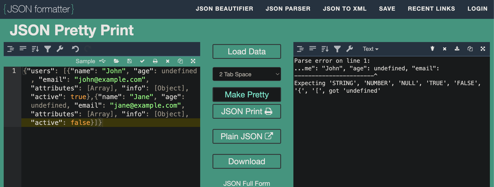
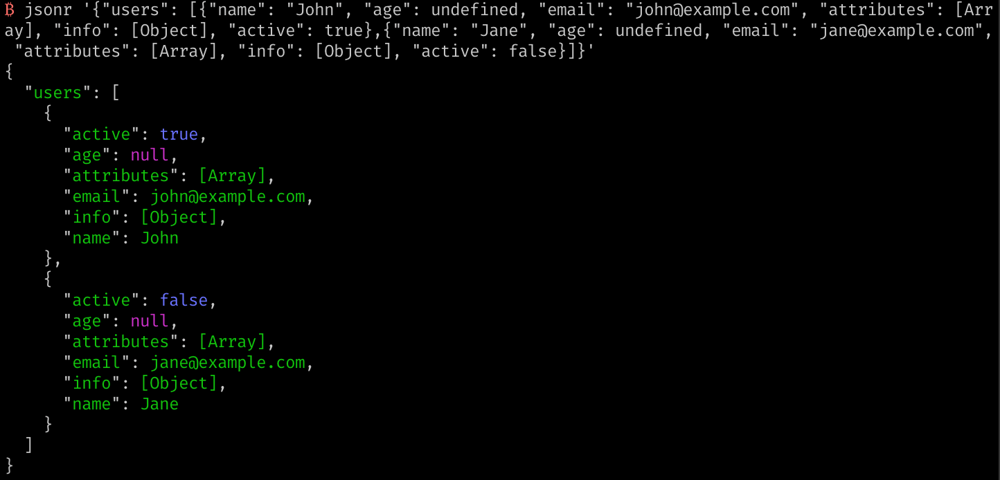

# JSONR

Regularize (Prettify) JSON from complex JS/TS objects for debugging

## Why

Have you ever run `console.log` in JS on an object an resulted in something that looks like this

```
{"users": [{"name": "John", "age": undefined, "email": "john@example.com", "attributes": [Array], "info": [Object], "active": true},{"name": "Jane", "age": undefined, "email": "jane@example.com", "attributes": [Array], "info": [Object], "active": false}]}
```

And you go to prettify that json to debug, and you get an error like this



This occurs because JSON format doesn't recognize undefined as a valid value. In fact, this is a common problem with logging complex objects to console with Javascript for debugging.

## What

`jsonr` solves this problem, by preprocessing the JSON so you can pass your logging of complex objects in javascript console directly to `jsonr` and it will colorize and prettify the output.



## Installation

To install `jsonr`, you need to have Rust installed on your machine. Then you can build and install `jsonr` using Cargo:

```bash
cargo build --release

cp target/release/jsonr /usr/local/bin/
```

### Command Line Options

- `-h, --help` - Print help information.
- `-V, --version` - Print version information.
